# 🦾 Low-Cost Master–Slave Surgical Teleoperation System

> Analytic Inverse Kinematics · ROS 2 Jazzy · Gazebo Harmonic · Firebase Realtime Database · ESP32

A proof-of-concept dual-implementation surgical teleoperation system inspired by the da Vinci Surgical System — built with off-the-shelf embedded hardware and open-source simulation tools, at a fraction of the cost.

---

## 📌 Table of Contents

- [Overview](#overview)
- [System Architecture](#system-architecture)
- [Hardware Implementation](#hardware-implementation)
  - [Components](#components)
  - [Communication Protocol](#communication-protocol)
  - [Master Controller](#master-controller)
  - [Slave Arm](#slave-arm)
- [Simulation Implementation](#simulation-implementation)
  - [Version 1 — RViz Dual-Robot](#version-1--rviz-dual-robot-proof-of-concept)
  - [Version 2 — Gazebo-Integrated](#version-2--gazebo-integrated-masterslave-system)
- [Kinematics](#kinematics)
- [Results](#results)
- [Challenges](#challenges)
- [Future Work](#future-work)


---

## Overview

Conventional laparoscopic surgery suffers from limited degrees of freedom, poor hand-eye coordination, and absent haptic feedback. This project presents a **low-cost master–slave teleoperation system** developed as a proof-of-concept for robotic-assisted surgery.

The system comprises:

1. **Hardware Layer** — Two ESP32 microcontrollers communicating over Wi-Fi via Firebase Realtime Database, driving a 3D-printed EEZYbotARM with MG90S and SG90 servos.
2. **Simulation Stack** — Two progressive ROS 2 / Gazebo simulation versions, from a basic RViz-only prototype to a full physics-driven simulation.

An analytic **3-DOF Inverse Kinematics (IK) solver** maps the master arm's Cartesian end-effector trajectory to the slave joint space in real time.

---

## System Architecture

```
┌─────────────────────────────── HARDWARE LAYER ───────────────────────────────┐
│                                                                               │
│   [Sensors]  ──►  [ESP32 Master]  ──►  [Firebase Wi-Fi Cloud]  ──►  [ESP32 Slave]  ──►  [3× Servos] │
│  (Pots + Hall)                                                                │
│                                                                               │
└───────────────────────────────────────────────────────────────────────────────┘

┌─────────────────────────────── SIMULATION LAYER ─────────────────────────────┐
│                                                                               │
│   [JSP GUI]  ──►  [IK Node ROS 2]  ──FK+IK──►  [ros2_control]  ──►  [Gazebo Harmonic]  ──►  [RViz2] │
│   (Master)                                                                    │
│                                                                               │
└───────────────────────────────────────────────────────────────────────────────┘
```

---

## Hardware Implementation

### Components

| Component | Function |
|---|---|
| ESP32 (×2) | Master and slave microcontroller |
| Potentiometer (×2) | Joint 1 & 2 analogue angle input |
| Hall-effect sensor | Magnetic gripper open/close detection |
| MG90S servo (×2) | Continuous-rotation arm joint drive |
| SG90 servo (×1) | Gripper open/close actuation |
| External 5V PSU | Dedicated servo power rail |
| Firebase Realtime DB | Cloud communication middleware |

### Hardware Photographs

<table>
  <tr>
    <td align="center">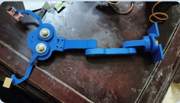<br/><b>Master Unit</b><br/>ESP32 + 2× potentiometers + Hall-effect sensor</td>
    <td align="center">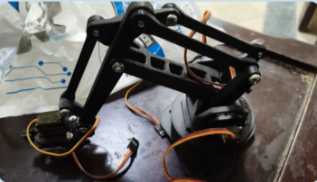<br/><b>Slave Arm</b><br/>3D-printed EEZYbotARM + MG90S + SG90 servos</td>
  </tr>
</table>

---

### Communication Protocol

A key design decision is the use of **Firebase Realtime Database** as the communication layer rather than a direct radio protocol.

```
Master ESP32                Firebase REST API              Slave ESP32
     │                             │                            │
     │── HTTP PATCH (500 ms) ─────►│                            │
     │   joint1_angle, joint2_angle│◄── HTTP GET (300 ms) ──────│
     │   gripper_state             │    fetch latest commands   │
     │                             │                            │
```

**Firebase database schema:**
```json
/robot
  joint1_raw      : int    (ADC 0–4095)
  joint1_angle    : int    (0–270 °)
  joint2_raw      : int    (ADC 0–4095)
  joint2_angle    : int    (0–270 °)
  hall_raw        : int    (ADC reading)
  gripper_state   : string ("OPEN" | "CLOSED")
```

> The slave retrieves only `joint1_angle`, `joint2_angle`, and `gripper_state`. Raw ADC fields are stored for diagnostics only.

**Performance Metrics:**

| Metric | Value |
|---|---|
| Firebase PATCH period | 500 ms (2 Hz) |
| Firebase GET period | 300 ms (~3.3 Hz) |
| Typical HTTP round-trip | 200–600 ms (Wi-Fi) |
| HTTP GET timeout | 10 s |
| Servo speed constant | 0.36 deg/ms |
| Servo settle delay | 200 ms post-move |
| Gripper actuation time | 600 ms + 200 ms settle |
| Hall sensor threshold | ADC < 2100 → CLOSED |
| ADC resolution | 12-bit (0–4095) |
| Joint angle range | 0–270° (mapped to 0–110° servo) |
| Wi-Fi reconnect timeout | 10 s (20 × 500 ms retries) |

---

### Master Controller

Reads three analogue inputs via ADC1 pins (ADC2 cannot be used concurrently with Wi-Fi):

- `GPIO 4` → Joint 1 potentiometer
- `GPIO 5` → Joint 2 potentiometer  
- `GPIO 6` → Hall-effect sensor

**Potentiometer mapping:**
$$\theta_i = \left\lfloor \frac{\text{ADC}_i}{4095} \times 270 \right\rfloor, \quad i \in \{1, 2\}$$

**Gripper logic:**
$$\text{gripper} = \begin{cases} \texttt{CLOSED} & \text{if } \text{ADC}_{\text{hall}} < 2100 \\ \texttt{OPEN} & \text{otherwise} \end{cases}$$

---

### Slave Arm

Polls Firebase every **300 ms**, parses the JSON response, and drives the servos.

**Servo pin assignment:**
- `GPIO 18` → servo1 (Joint 1, continuous-rotation MG90S)
- `GPIO 19` → servo2 (Joint 2, continuous-rotation MG90S)
- `GPIO 37` → gripperServo (SG90, positional)

**Continuous-rotation servo drive** — incremental position tracking:

$$\delta_i = \theta_{\text{target},i} - \theta_{\text{current},i}$$

$$t_{\text{run}} = \frac{|\delta_i|}{0.36 \text{ deg/ms}}$$

Movements < 1° are ignored. The servo spins at full speed for `t_run` ms, then halts at 90°, followed by a 200 ms settle delay.

**Servo travel remapping** (constrained EEZYbotARM range):

$$\theta_{\text{servo}} = \operatorname{constrain}(\theta_{\text{pot}},\ 120°,\ 230°) - 120°$$

Effective servo range: **0–110°**.

---

## Simulation Implementation

### Software Stack

| Component | Version |
|---|---|
| OS | Ubuntu 24.04 |
| ROS 2 | Jazzy |
| Simulator | Gazebo Harmonic |
| Robot model | `arm_3dof_gripper.xacro` |
| Controllers | `position_controllers/JointGroupPositionController` |
| Control rate | 100 Hz |

---

### Version 1 — RViz Dual-Robot Proof-of-Concept

The team's first ROS 2 simulation. Used a **simplified generic arm** (not matching the physical EEZYbotARM geometry) to validate the control architecture and IK implementation.

Two identical robot models visualised inside RViz2 via separate namespaces `/master` and `/slave`.

**Key outcomes:**
- ✅ Validated the analytic IK solution
- ✅ Debugged TF and namespace conflicts
- ✅ Established the ROS 2 topic graph architecture
- ✅ Verified basic master–slave synchronisation

#### Step-by-Step Launch Procedure

**Step 1 — Build and launch RViz visualiser**

```bash
cd ~/surgical_ws
colcon build --packages-select surgical_robot_description
source install/setup.bash
ros2 launch surgical_robot_description display.launch.py
```

<table>
  <tr>
    <td align="center">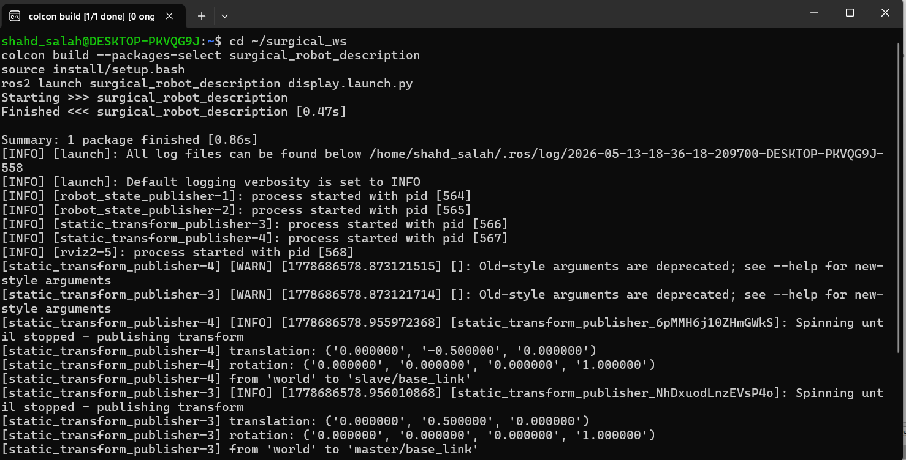<br/>Terminal 1 build output</td>
    <td align="center">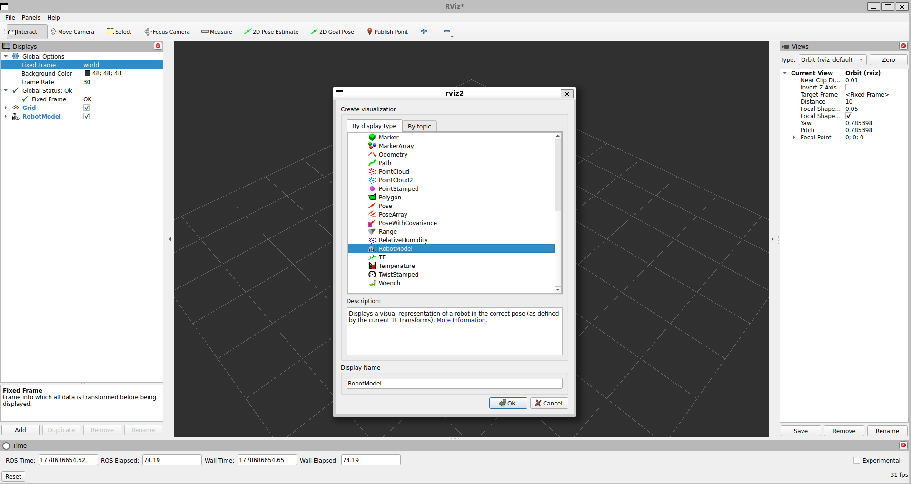<br/>RViz2 with robot model loaded</td>
  </tr>
</table>

**Step 2 — Start the marker control node**

```bash
source ~/surgical_ws/install/setup.bash
ros2 run surgical_robot_description marker_control.py
```

<table>
  <tr>
    <td align="center">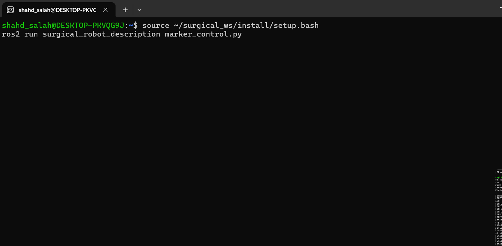<br/>Terminal 2 marker control node</td>
    <td align="center">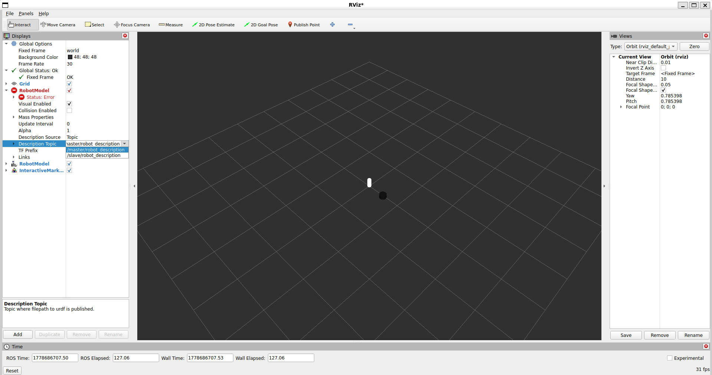<br/>Interactive markers in RViz2</td>
  </tr>
</table>

**Step 3 — Launch the teleoperation bridge**

```bash
source ~/surgical_ws/install/setup.bash
ros2 run surgical_robot_description teleop_bridge.py
```

<table>
  <tr>
    <td align="center">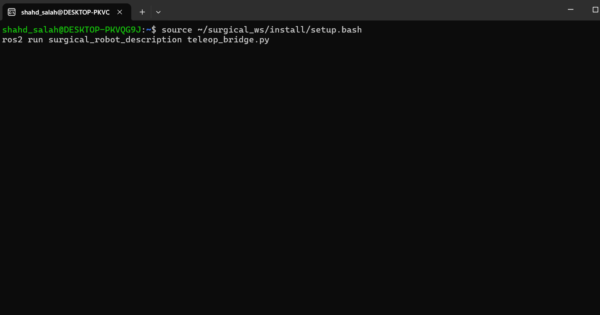<br/>Terminal 3 teleop bridge</td>
    <td align="center">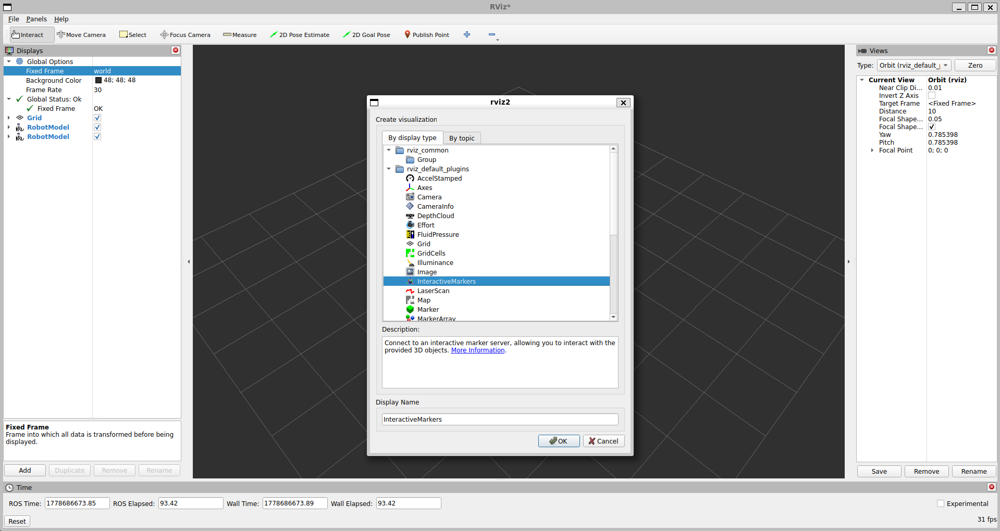<br/>Slave robot tracking master motion</td>
  </tr>
</table>

**Step 4 — Final result**

<table>
  <tr>
    <td align="center">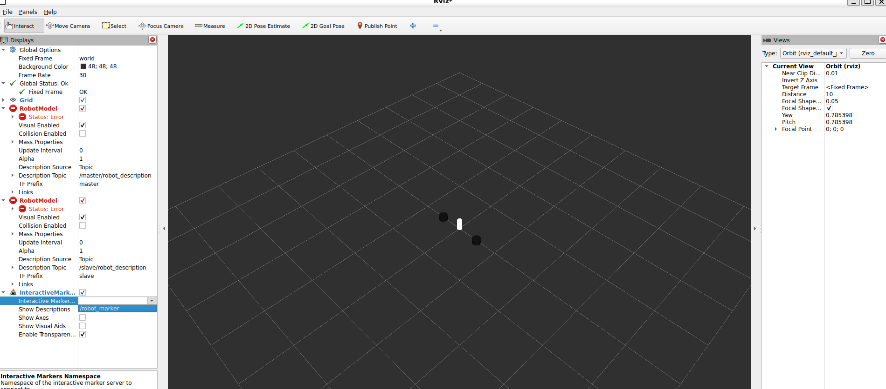<br/>Dual-robot RViz2 scene</td>
    <td align="center"><br/>Final master–slave synchronisation</td>
  </tr>
</table>

<p align="center">
  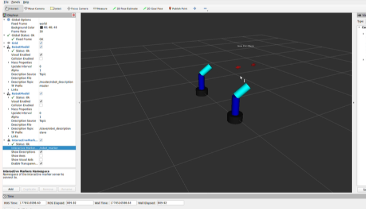<br/>
  <i>Simulation Version 1: RViz-only dual-robot prototype</i>
</p>

---

### Version 2 — Gazebo-Integrated Master–Slave System

The **final and fully integrated** simulation. Uses the **same kinematic model as the physical EEZYbotARM**, making the simulation directly representative of the real hardware.

- Slave arm controlled via `ros2_control` position controllers inside **Gazebo Harmonic**
- Master arm visualised in **RViz2** under `/master` namespace
- IK node runs at **~50 Hz**
- `/clock` bridge synchronises Gazebo simulation time with ROS 2

#### Launch Procedure

```bash
cd ~/master-slave-robotic-arm-main
source install/setup.bash
export GZ_RENDERING_ENGINE_GUESS=ogre
ros2 launch zayan master_slave.launch.py
```

> `GZ_RENDERING_ENGINE_GUESS=ogre` forces Gazebo Harmonic to use the OGRE backend, avoiding rendering-plugin conflicts on Ubuntu 24.04.

Three windows open simultaneously:
- **Gazebo Harmonic** — slave-arm physics simulation
- **RViz2** — master-arm visualisation
- **Joint State Publisher GUI** — master-arm input control

<p align="center">
  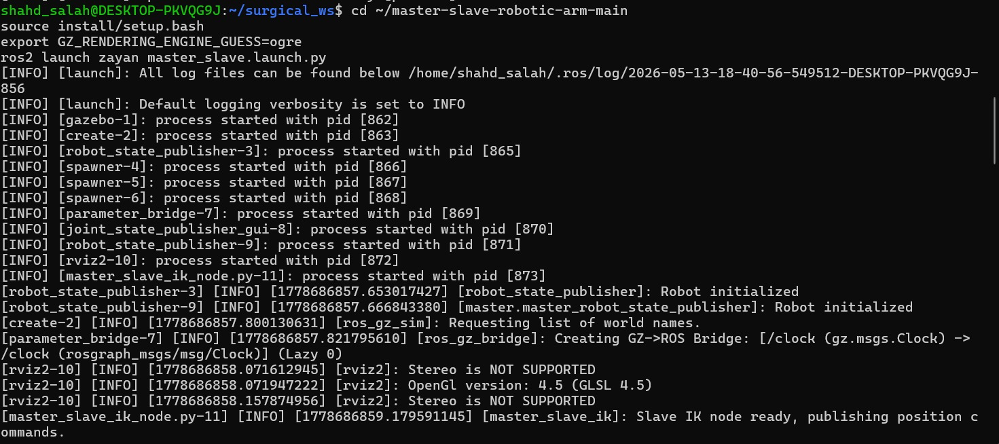<br/>
  <i>Version 2 launch terminal — Gazebo, controller spawners, IK node, and /clock bridge</i>
</p>


<p align="center">
  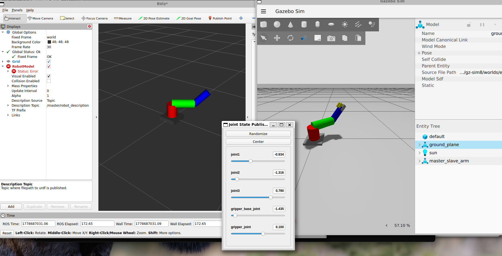<br/>
  <i>Version 2 final: full master–slave synchronisation inside Gazebo Harmonic</i>
</p>

<p align="center">
  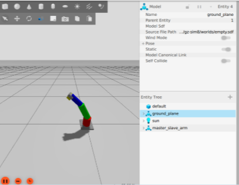<br/>
  <i>Simulation Version 2: Gazebo Harmonic physics-based simulation with real-time Cartesian tracking</i>
</p>

---

### Simulation Version Comparison

| Feature | Version 1 | Version 2 | Hardware |
|---|---|---|---|
| Robot model | Generic arm | EEZYbotARM | EEZYbotARM |
| Physics engine | None | Gazebo Harmonic | Real hardware |
| Slave control | Visual only | ros2_control | ESP32 PWM |
| IK solver | Basic IK | Full analytic IK | N/A |
| Gripper support | No | Yes | Yes |
| Communication | ROS topics | ROS topics | Firebase Wi-Fi |

---

### ROS 2 Package Structure

```
zayan/
├── config/
│   └── arm_3dof_controllers.yaml
├── launch/
│   ├── display_3dof_launch.py
│   └── master_slave_launch.py
├── rviz/
│   └── display_3dof.rviz
├── scripts/
│   └── master_slave_ik_node.py
└── urdf/
    └── arm_3dof_gripper.xacro
```

---

## Kinematics

### Robot Geometry

| Parameter | Value |
|---|---|
| L₁ (base → shoulder) | 0.15 m |
| L₂ (shoulder → elbow) | 0.25 m |
| L₃ (elbow → wrist) | 0.20 m |
| Max reach | 0.60 m |

Joint 1 rotates about the global Z-axis. Joints 2 and 3 produce planar elevation in the vertical sagittal plane.

### Forward Kinematics

$$r_{\text{plane}} = L_2 \sin q_2 + L_3 \sin(q_2 + q_3)$$

$$x = \cos q_1 \cdot r_{\text{plane}}, \quad y = \sin q_1 \cdot r_{\text{plane}}$$

$$z = L_1 + L_2 \cos q_2 + L_3 \cos(q_2 + q_3)$$

### Inverse Kinematics

Given target

$$
\mathbf{p}_d = (x_d, y_d, z_d)
$$

**Base rotation**

$$
\theta_1 = \operatorname{atan2}(y_d, x_d)
$$

**Workspace clamping**

$$
r = \sqrt{x_d^2 + y_d^2}
$$

$$
z' = z_d - L_1
$$

$$
d = \sqrt{r^2 + z'^2}
$$

$$
d \leftarrow \min\big(\max(d,|L_2-L_3|),L_2+L_3\big)
$$

---

## Results

### Hardware

- **Communication latency:** 200–600 ms end-to-end (Firebase HTTP round-trip)
- **Upload rate:** Master at 2 Hz (500 ms), slave polls at ~3.3 Hz (300 ms)
- **Wireless reliability:** Firebase provided stable connectivity; reconnection guard handled transient dropouts
- **Gripper:** Hall-effect sensor provided reliable binary open/close detection with hysteresis

### Simulation

- **FK/IK accuracy:** Maximum joint-angle error < 0.5° for all reachable targets
- **Simulation rate:** 100 Hz, stable over 10-minute continuous test sessions with no dropped control commands

---

## Challenges

| Challenge | Solution |
|---|---|
| ESP32 ADC2 pin conflict with Wi-Fi | Routed all sensor inputs to ADC1 pins (GPIO 4, 5, 6) |
| Firebase HTTP stale data reads | `http.setReuse(false)` + `Connection: close` header |
| Wi-Fi radio entering power-save mode | `WiFi.setSleep(false)` after each GET request |
| Multi-namespace TF tree conflicts | Frame prefix `master_` + explicit topic remapping |
| Gazebo–ros2_control sync | `TimerAction` 3 s delay in launch file before controller spawner |
| IK workspace singularities | Clamped cosine-rule argument to `[-1, 1]` before `acos` |
| Firebase HTTP latency (200–600 ms) | Inherent trade-off for internet-range operability |
| Simulation-to-hardware geometry gap | Version 2 adopted the exact EEZYbotARM geometry |

---

## Limitations

- **No haptic feedback** — slave does not report contact forces to master
- **Limited DOF** — 3 joints vs. 6–7 DOF required for clinical systems
- **No hardware–simulation bridge** — ROS 2 simulation and Firebase subsystems operate independently
- **High cloud latency** — 200–600 ms unsuitable for direct surgical teleoperation
- **Sensor wear** — potentiometers exhibit resistive wear; magnetic encoders preferred
- **Security** — Firebase API keys embedded in firmware; key rotation needed before clinical use

---

## Future Work

- [ ] **Hardware–ROS 2 integration** — bridge Firebase into ROS 2 so the physical arm is commanded directly by the IK node
- [ ] **Latency reduction** — replace Firebase HTTP polling with WebSocket or MQTT, targeting < 50 ms round-trip
- [ ] **Haptic feedback** — add force sensors to slave gripper; return contact data to master via vibration actuators
- [ ] **Higher DOF** — extend URDF and IK solver to 5–6 DOF
- [ ] **Camera vision** — attach camera link in Gazebo; stream stereo view to operator console
- [ ] **5G / low-latency teleoperation** — evaluate over high-bandwidth 5G link with MQTT or WebRTC
- [ ] **Security hardening** — Firebase security rules, API key rotation, payload integrity checks
- [ ] **Magnetic encoder upgrade** — replace potentiometers with AS5048 encoders


---

## References

1. B. Morris, "Robotic surgery: applications, limitations, and impact on surgical education," *MedGenMed*, vol. 7, no. 3, p. 72, Sep. 2005.
2. J. R. Adler, "Remote robotic spine surgery," *Neurospine*, vol. 17, no. 1, pp. 1–2, Mar. 2020.
3. Z. Khan et al., "Telesurgery and robotics: an improved and efficient era," *Cureus*, vol. 13, no. 4, p. e14310, Apr. 2021.
4. Intuitive Surgical, "da Vinci Surgical System," Intuitive Surgical Inc., Sunnyvale, CA, USA.

---

<p align="center">
  <i>Biomedical & Robotics Engineering Department — 2025</i>
</p>
